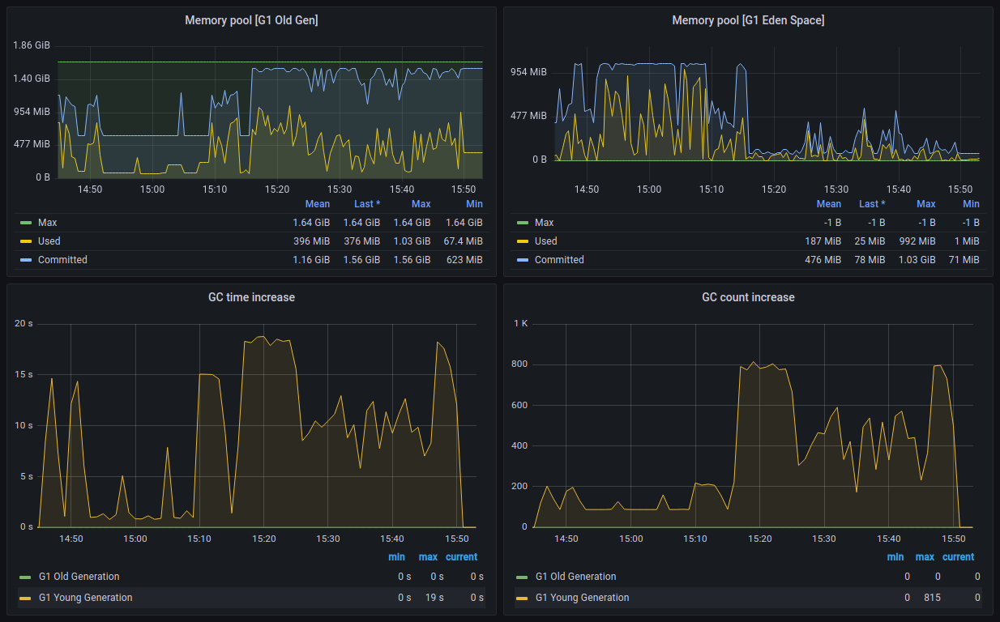

# Store events via th2-estore:5.7.0-dev (perftest cluster)

## Hardware configuration

### Cluster

+ **CPU**: Intel Xeon Gold 5218 x 2
+ **RAM**: 768 GB (32 GB RAM x 24)
+ **Disk**: SAMSUNG MZ7LM3T8HMLP SSD 3,5Tb x 5 (raid5 + Hotspare)

### Virtual machines are deployed on the cluster:

+ **cassandra**
  + **CPU**: 4 core
  + **RAM**: 8Gb
+ **cluster node** - x2
  + **CPU**: 11 core
  + **RAM**: 30Gb

## Software configuration

### RabbitMQ
+ **VM**: cluster node
+ **Docker image**: docker.io/bitnami/rabbitmq:3.11.2-debian-11-r0

### Cassandra
+ **VM**: cassandra
+ **Version**: 4.0.5
+ **Special java args**:
  + -Xlog:gc=info,heap*=debug,age*=debug,safepoint=info,promotion*=debug...
  + -Xms4G -Xmx4G

## Cluster schema


## th2 components configuration

### woodpecker
```yaml
apiVersion: th2.exactpro.com/v2
kind: Th2Box
metadata:
  name: woodpecker1
spec:
  disabled: false
  imageName: ghcr.io/th2-net/th2-woodpecker-template
  imageVersion: 2.0.0-TH2-5204-estore-perf-9547964275-56d1114
  type: th2-conn
  customConfig:
    tickRate: 1
    maxBatchSize: 175
    useTransportMode: EVENT_MODE
    generatorSettings:
      messageGeneratorSettings:
        bookName: test_book
        sessionGroupPrefix: raw-group
        sessionGroupNumber: 1
        sessionAliasPrefix: raw-session-alias
        sessionAliasNumber: 1
        protocol: fix
        oneOf:
          directionToExamples:
            SECOND:
              messages:
                - 'raw-message'
      eventGeneratorSettings:
        bookName: estore_perf_test_01
        scope: qa_session_01
        generationMode: SINGLE_ROOT
        treeDepth: 0
        childCount: 0
        failureRate: 0
        descriptionLength: 0
        bodyDataLength: 200
  pins:
    mq:
      subscribers:
        - name: in_events
          attributes: [event, in]
        - name: in_messages
          attributes: [subscribe, in, protobuf-group]
      publishers:
        - name: out_messages
          attributes: [publish, out, raw, store, protobuf-group]
    grpc:
      server:
        - name: server
          serviceClasses:
            - com.exactpro.th2.woodpecker.grpc.WoodpeckerService
  extendedSettings:
    nodeSelector:
      "kubernetes.io/hostname": node-2
    envVariables:
      JAVA_TOOL_OPTIONS: >
        -Djava.net.preferIPv4Stack=true
    resources:
      limits:
        cpu: 2000m
        memory: 1000Mi
      requests:
        cpu: 500m
        memory: 200Mi
```

### estore
```yaml
apiVersion: th2.exactpro.com/v2
kind: Th2Estore
metadata:
  name: estore
spec:
  imageName: ghcr.io/th2-net/th2-estore
  imageVersion: 5.7.0-dev
  cradleManager:
    prepareStorage: false
    timeout: 5000
    resultPageSize: 1000
    composingServiceThreads: 1
    counterPersistenceInterval: 15000
    maxUncompressedTestEventSize: 5120
    compressionType: LZ4
    bookRefreshIntervalMillis: 60000
  customConfig:
    maxTaskCount : 128
    maxTaskDataSize : 536870912 
    maxRetryCount : 3
    processingThreads: 1 
  mqRouter:
    prefetchCount: 160 # 125 % of maxTaskCount
  extendedSettings:
    nodeSelector:
      "kubernetes.io/hostname": node-1
    envVariables:
      JAVA_TOOL_OPTIONS: >
        -XX:+ExitOnOutOfMemoryError
        -XX:+UseContainerSupport
        -Dlog4j2.shutdownHookEnabled=false
        -XX:MaxRAMPercentage=84.2
        -XX:MaxMetaspaceSize=70M
        -XX:CompressedClassSpaceSize=10M
        -XX:ReservedCodeCacheSize=40M
        -XX:MaxDirectMemorySize=50M
        -Ddatastax-java-driver.advanced.connection.init-query-timeout="5000 milliseconds"
        -Ddatastax-java-driver.basic.request.timeout="3 seconds"
    resources:
      limits:
        cpu: 3000m
        memory: 2000Mi
      requests:
        cpu: 1000m
        memory: 100Mi
```
## performance test parameters

### cradle parameters
Only one page is used for the whole test because use case is uploading 100'000 events per second into usual namespace (one cradle page per day) during short period 

### events parameters
* tree structure: one root, several children in batches
<br><br>
* body: generated JSON with 1.1 kB size
* attached messages: 1
* status: success

### steps parameters for woodpeckers x2
| step | maxBatchSize | duration |
|:-----|:-------------|:---------|
| 1    | 300          | 30 min   |
| 2    | 400          | ~30 min  |

## metrics during performance tests execution

### events received by estore (avg)

| step | events in batch | batch size<br/>(serialized protobuf) | event size<br/>(serialized protobuf) | event rate   |
|------|-----------------|--------------------------------------|--------------------------------------|--------------|
| 1    | 299             | 436 KiB                              | 1.46 KiB                             | 99K item/s   |
| 2    | 400             | 582 KiB                              | 1.46 KiB                             | 80.6K item/s |


### cradle (avg)

| step | raw rate  | compressed rate | compression |
|------|-----------|-----------------|-------------|
| 1    | 127 MiB/s | 23.5 MiB/s      | 5.39 times  |
| 2    | 103 MiB/s | 19.1 MiB/s      | 5.40 times  |


### computation resources by estore (max)

| step | CPU | CPU throttling | RAM      |
|------|-----|----------------|----------|
| 1    | 2.6 | 13.2 %         | 1.9 GiB  |
| 2    | 2.9 | 70.7 %         | 1.91 GiB |


### JVM metrics of estore (max)

| step | HEAP     | old gen  | yang gen | GC count<br/>old gen | GC count<br/>yang gen |
|------|----------|----------|----------|----------------------|-----------------------|
| 1    | 1.13 GiB | 881 MiB  | 992 MiB  | 0                    | 218 times/s           |
| 2    | 1.13 GiB | 1.03 GiB | 449 MiB  | 0                    | 815 times/s           |




## Computation resources RabbitMQ (max)

| step | CPU  | RAM      |
|------|------|----------|
| 1    | 0.73 | 594 MiB  |
| 2    | 1.62 | 1.99 GiB |


## Computation resources Cassandra (max)

| step | CPU  | RAM     | Network     |
|------|------|---------|-------------|
| 1    | 1.35 | 5.8 GiB | 290.41 Mbps |
| 2    | 1.2  | 5.7 GiB | 273.12 Mbps |


