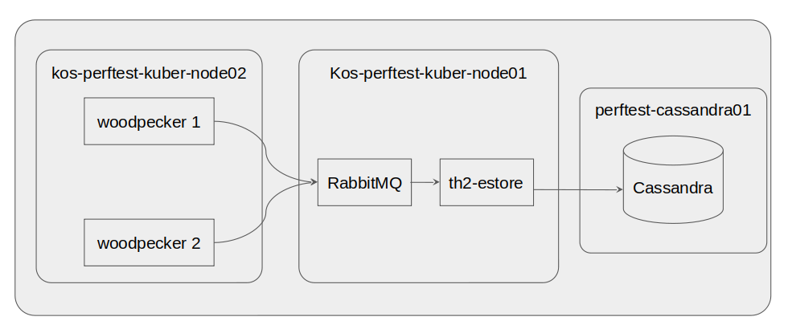
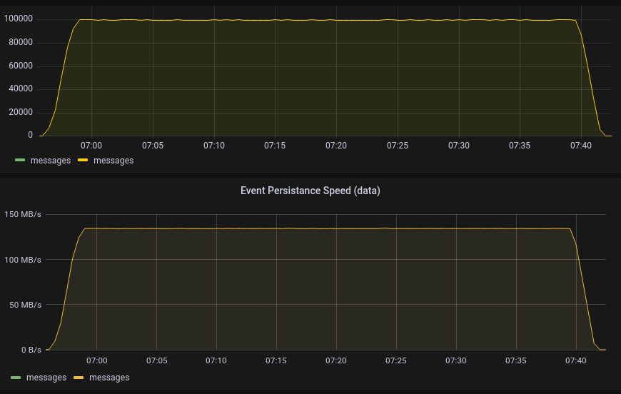
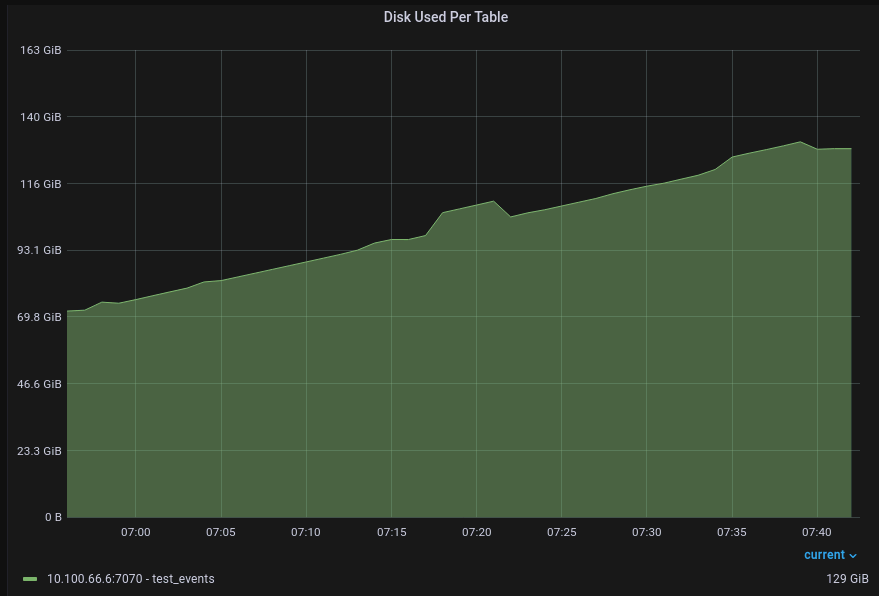
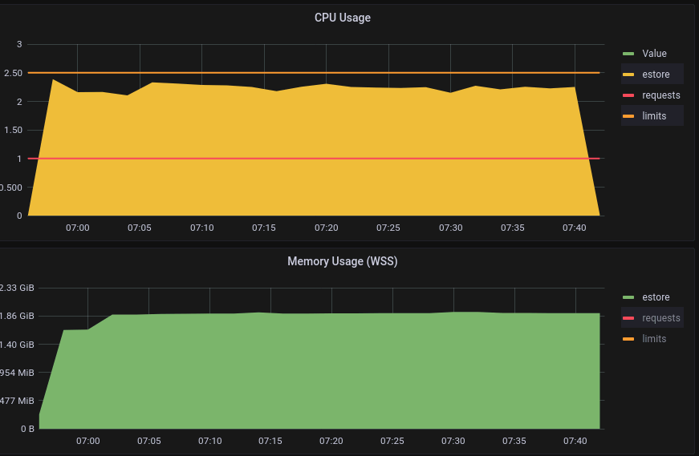
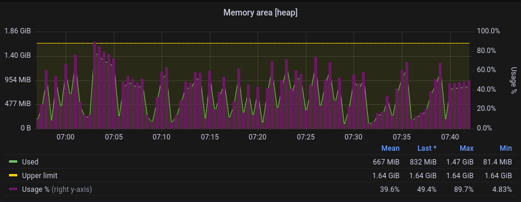
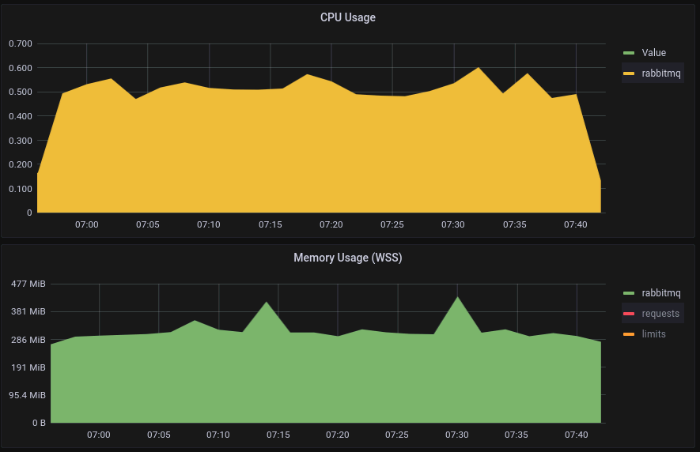

# Store events via th2-estore (perftest cluster)

## Hardware configuration

### Server

+ **CPU**: Intel Xeon Gold 5218 x 2
+ **RAM**: 768 GB (32 GB RAM x 24)
+ **Disk**: SAMSUNG MZ7LM3T8HMLP SSD 3,5Tb x 5 (raid5 + Hotspare)

### Virtual machines are deployed on de-qa18 server:

+ **perftest-cassandra01** - cassandra
  + **CPU**: 4 core
  + **RAM**: 8Gb
+ **kos-perftest-kuber-node01** - cluster node
  + **CPU**: 11 core
  + **RAM**: 30Gb
+ **kos-perftest-kuber-node02** - cluster node
  + **CPU**: 11 core
  + **RAM**: 30Gb

## Software configuration (perftest cluster)

### RabbitMQ
+ **VM**: kos-perftest-kuber-node01
+ **Docker image**: docker.io/bitnami/rabbitmq:3.11.2-debian-11-r0

### Cassandra
+ **VM**: perftest-cassandra01
+ **Version**: 4.0.5
+ **Special java args**:
  + -Xlog:gc=info,heap*=debug,age*=debug,safepoint=info,promotion*=debug...
  + -Xms4G -Xmx4G

## Cluster schema


## th2 components configuration (perftest cluster)

scheme configuration:
https://gitlab.exactpro.com/vivarium/th2/th2-internal-instances/th2-perf-schemas/-/commit/0b8dc314356aaa12816f0165408137ac24584781

### woodpecker
+ **Docker image**: ghcr.io/th2-net/th2-woodpecker-template:2.0.0-TH2-5204-estore-perf-9406747565-897a638
+ **Data format**: protobuf

### estore
```yaml
apiVersion: th2.exactpro.com/v2
kind: Th2Estore
metadata:
  name: estore
spec:
  imageName: ghcr.io/th2-net/th2-estore
  imageVersion: 5.7.0-dev
  cradleManager:
    prepareStorage: false
    timeout: 5000
    pageSize: 1000
    composingServiceThreads: 4
    counterPersistenceInterval: 15000
    maxUncompressedTestEventSize: 0
    maxUncompressedMessageBatchSize: 0
    storeIndividualMessageSessions: false
    compressionType: LZ4
    bookRefreshIntervalMillis: 60000
  customConfig:
    maxTaskCount : 128
    maxTaskDataSize : 536870912
    maxRetryCount : 3
  mqRouter:
    prefetchCount: 1000
  extendedSettings:
    envVariables:
      JAVA_TOOL_OPTIONS: >
        -XX:+ExitOnOutOfMemoryError
        -XX:+UseContainerSupport
        -Dlog4j2.shutdownHookEnabled=false
        -XX:MaxRAMPercentage=84.2
        -XX:MaxMetaspaceSize=70M
        -XX:CompressedClassSpaceSize=10M
        -XX:ReservedCodeCacheSize=40M
        -XX:MaxDirectMemorySize=50M
        -Ddatastax-java-driver.advanced.connection.init-query-timeout="5000 milliseconds"
        -Ddatastax-java-driver.basic.request.timeout="3 seconds"
        -Dcom.sun.management.jmxremote
        -Dcom.sun.management.jmxremote.port=1099
        -Dcom.sun.management.jmxremote.rmi.port=1099
        -Dcom.sun.management.jmxremote.ssl=false
        -Dcom.sun.management.jmxremote.authenticate=false
        -Dcom.sun.management.jmxremote.local.only=false
        -Djava.rmi.server.hostname=127.0.0.1
    resources:
      limits:
        cpu: 2500m
        memory: 2000Mi
      requests:
        cpu: 1000m
        memory: 100Mi
```

## Test parameters
| woodpeckers (n) | batch size (events) | event size (KB) | attached messages (n) | load duration (min) | page duration (days) |
|-----------------|---------------------|-----------------|-----------------------|---------------------|----------------------|
| 2               | 700                 | 1.37            | 1                     | 40                  | 1                    |

| component  | rate (event/sec) | rate (MB/sec) | Total data size (GB) | Total events (n) |
|------------|------------------|---------------|----------------------|------------------|
| woodpecker | 50,000           | 67            | 157.0                | 90,000,000       |
| total x2   | 100,000          | 134           | 314.1                | 180,000,000      |

## th2-estore metrics


## Cassandra metrics


## Computation resources

|             | RabbitMQ | th2-estore | Cassandra |
|-------------|----------|------------|-----------|
| CPU (cores) | 0.6      | 2.3        |           |
| RAM         | 433 MB   | 1.93 GB    | 3.8 GB    |

## Computation resources th2-estore metrics



## Computation resources RabbitMQ metrics
