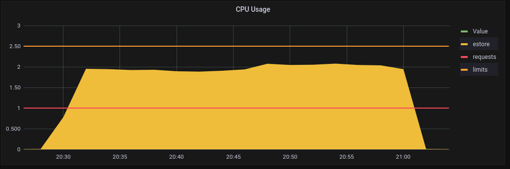
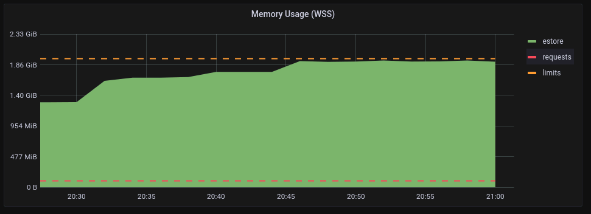
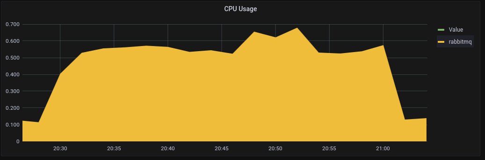
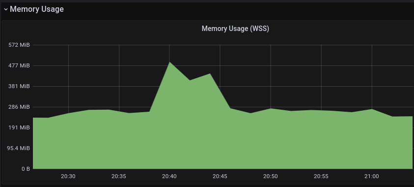

# Store events via th2-estore (perftest cluster)

## Hardware configuration

### Server

+ **CPU**: Intel Xeon Gold 5218 x 2
+ **RAM**: 768 GB (32 GB RAM x 24)
+ **Disk**: SAMSUNG MZ7LM3T8HMLP SSD 3,5Tb x 5 (raid5 + Hotspare)

### Virtual machines are deployed on de-qa18 server:

+ **perftest-cassandra01** - cassandra
  + **CPU**: 4 core
  + **RAM**: 8Gb
+ **kos-perftest-kuber-node01** - cluster node
  + **CPU**: 11 core
  + **RAM**: 30Gb
+ **kos-perftest-kuber-node02** - cluster node
  + **CPU**: 11 core
  + **RAM**: 30Gb

## Software configuration (perftest cluster)

### RabbitMQ
+ **VM**: kos-perftest-kuber-node01
+ **Docker image**: docker.io/bitnami/rabbitmq:3.11.2-debian-11-r0

### Cassandra
+ **VM**: perftest-cassandra01
+ **Version**: 4.0.5
+ **Special java args**:
  + -Xlog:gc=info,heap*=debug,age*=debug,safepoint=info,promotion*=debug...
  + -Xms4G -Xmx4G

## Cluster schema

## th2 components configuration (perftest cluster)

### woodpecker
+ **Docker image**: ghcr.io/th2-net/th2-woodpecker-template:2.0.0-TH2-5204-estore-perf-9406747565-897a638
+ **Data format**: protobuf

### estore
+ **Docker image**: ghcr.io/th2-net/th2-estore:5.7.0-external-executor-9384699236-c134f80
+ **Cradle compression type**: LZ4
+ **Store to tables**: test_events

## Test parameters
| woodpeckers (n) | batch size (events) | event size (KB) | load duration (min) | page duration (days) |
|-----------------|---------------------|-----------------|---------------------|----------------------|
| 2               | 700                 | 1.37            | 30                  | 1                    |

| component  | rate (event/sec) | rate (MB/sec) | Total data size (GB) | Total events (n) |
|------------|------------------|---------------|----------------------|------------------|
| woodpecker | 50,000           | 66.9          | 117.6                | 90,000,000       |
| total x2   | 100,000          | 133.8         | 235.2                | 180,000,000      |

## th2-estore metrics

## Cassandra metrics

## Computation resources

|             | RabbitMQ | th2-estore | Cassandra |
|-------------|----------|------------|-----------|
| CPU (cores) | 0.6      | 2.0        |           |
| RAM         | 495 MB   | 1.95 GB    | 3.8 GB    |

## Computation resources th2-estore metrics

## Computation resources RabbitMQ metrics

